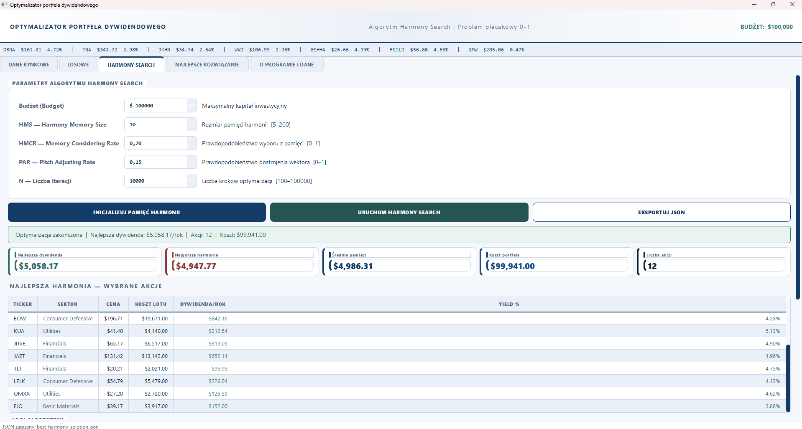

# Optymalizator Portfela Dywidendowego - Harmony Search
**Autor:** Kacper Woszczyło 21324




## Opis projektu

System optymalizacji portfela inwestycyjnego rozwiązujący dyskretny problem plecakowy (0-1 Knapsack Problem) przy użyciu metaheurystycznego algorytmu Harmony Search z uwzględnieniem modyfikacji PAR (Pitch Adjusting Rate). Narzędzie respektuje ograniczenia budżetowe oraz limity sektorowe, maksymalizując roczny dochód z dywidend.

## Struktura projektu

```text
si_project/
├── config.py             # Inicjalizacja parametrów algorytmu (HMS, HMCR, PAR, n)
├── database.py           # Ładowanie danych z pliku CSV
├── generate_data.py      # Generator danych testowych
├── gui_app.py            # Główna aplikacja okienkowa (PyQt5)
├── harmony_search.py     # Implementacja algorytmu Harmony Search
├── random_solution.py    # Generator losowych rozwiązań
├── stock_data.csv        # Baza danych akcji
└── dokumentacja/         # Dokumentacja i zasoby graficzne
```

## Jak uruchomić

1. Zainstaluj wymagane biblioteki:

	```
	pip install PyQt5
	```

2. Uruchom aplikację:

	```
	python gui_app.py
	```
